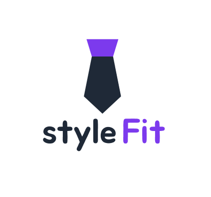
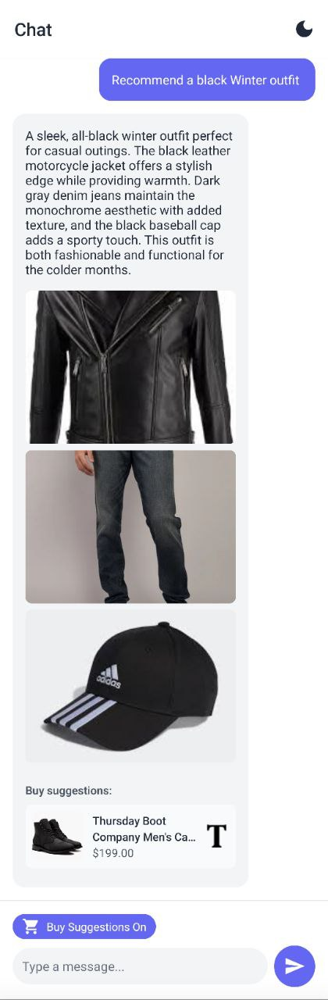

# StyleFit

StyleFit is a smart outfit suggestion system that helps users organize their wardrobe, categorize clothing items, and receive personalized outfit recommendations based on seasons, occasions, and personal style.

## About Us

We are a passionate team of developers and fashion enthusiasts who believe that everyone deserves to look their best without the stress of decision-making. Our mission is to revolutionize how people manage their wardrobes and make fashion choices.

### Our Vision
To create an intelligent fashion companion that helps users make confident style decisions while maintaining their unique personal expression.

### Our Mission
To simplify wardrobe management and outfit planning through innovative technology, making fashion accessible and enjoyable for everyone.

## Application Appearance

StyleFit features a modern, intuitive interface designed to make wardrobe management effortless and enjoyable. Here's a glimpse of our application:

### App Splash


### Key Features in Action

#### Virtual Closet View


Our intuitive closet view helps you organize and visualize your entire wardrobe at a glance.

#### Item Management


Detailed view of each clothing item with comprehensive information and categorization.

#### Easy Item Upload


Simple and quick process to add new items to your wardrobe.

#### Smart Style Assistant


Get personalized style recommendations and outfit suggestions
through our AI-powered chat interface.

### Key Design Elements
- **Modern UI Components**: Sleek, responsive design elements that work seamlessly across devices
- **Intuitive Navigation**: Easy-to-use interface for managing your wardrobe
- **Visual Organization**: Clear categorization and visual representation of clothing items
- **Smart Suggestions**: Beautifully presented outfit recommendations

## Key Features

### 👕 Clothing Categorization
- Store and manage clothing items by **Category** (Accessory, Top, Bottom, Dress, Footwear)
- Support for various **Materials** (Cotton, Linen, Denim, Wool, etc.)
- Identify **Patterns** (Solid, Striped, Checked, Floral, etc.)

### 🎨 Smart Color & Season Matching
- Classify outfits based on **Color** (Red, Blue, Black, etc.)
- Tag outfits according to **Seasons** (Summer, Winter, Spring, Autumn)
- Suggest outfits that match seasonal trends

### 🎭 Occasion-Based Outfit Suggestions
- Categorize outfits by **Type** (Formal, Semi-Formal, Casual)
- Get style recommendations tailored to specific events

## Tech Stack
- **Backend:** Django, Django REST Framework
- **Database:** MongoDB
- **Frontend:** React.js

## Installation & Setup

1. **Clone the repository:**
   ```bash
   git clone https://github.com/yourusername/stylefit.git
   cd stylefit
   ```
2. **Create a virtual environment and install dependencies:**
   ```bash
   python -m venv venv
   source venv/bin/activate  # On Windows use `venv\Scripts\activate`
   pip install -r requirements.txt
   ```
3. **Set up MongoDB:**
   - Install MongoDB and start the service
   - Configure the database connection in Django settings

4. **Run the development server:**
   ```bash
   python manage.py runserver
   ```

## Example JSON Representation
```json
{
    "Id": "1a2b3c",
    "Category": "top",
    "Color": "blue",
    "Season": "summer",
    "Type": "casual",
    "Pattern": "solid",
    "Material": "cotton",
    "Description": "Lightweight blue t-shirt for summer",
    "Image": "path/to/image.jpeg"
}
```

## Future Enhancements
- AI-powered outfit suggestions based on user preferences
- Integration with e-commerce platforms for style inspiration
- Social sharing of outfit combinations
- virtual try on

## Contributing
Pull requests are welcome! If you'd like to contribute, feel free to fork the repository and submit a PR.

## License
MIT License © 2025 StyleFit